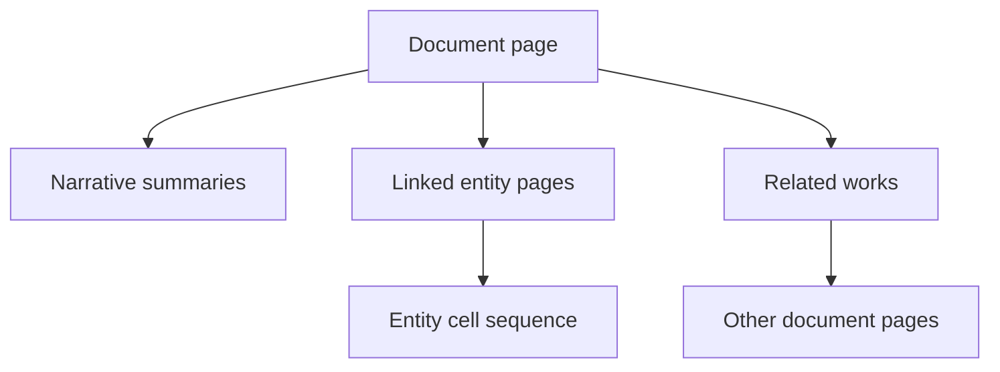

# The wiki as a projection of the retrieval structure

2026-09-08. Justin's design note, refining the wiki from "HTML that exposes the database" to a
reader-facing representation assembled from it. The earlier framing (in this day's `render_package`
work) treated the page's job as showing the store; this corrects that.

## Document page

A document page contains:

- The document abstract as its lead.
- The ordered unit summaries as its body.
- Entity names inside those summaries linked to entity pages.
- Basic document metadata.
- Links to related works discovered through shared entities.

Facts about entities do **not** appear on the document page. A fact belongs to the supporting
machinery unless it is genuinely about the document itself:

- The document was written by someone.
- The document was published on a date.
- The document evaluates a system.
- The document belongs to a series.
- The document is a revision of another document.

## Related works, from shared entities

The shared-entity links produce bodies of work without imposing a taxonomy beforehand. A
document's related-work score can begin simply, as the salience-weighted overlap of shared
entities:

    R(d1, d2) = sum over e in E(d1) ∩ E(d2) of  w_salience(e, d1) · w_salience(e, d2) · w_rarity(e)

The rarity term matters: sharing `Zep`, `Graphiti`, or `LongMemEval` is informative; sharing
`large language models` is not. An IDF-like term suppresses ubiquitous entities:

    w_rarity(e) = log( N / (1 + docs(e)) )

where N is the number of documents and docs(e) is how many contain e. That yields emergent
clusters:

- Papers about Zep and Graphiti.
- Oz books sharing Dorothy, Ozma, and the Scarecrow.
- Conversations about one software project.
- Documents associated with one course, employer, trip, or medical issue.

These are not stored collections. They are views induced by the graph, and they change as
documents arrive or entity attachments are corrected.

## Entity page

Similarly restrained:

- Entity abstract as the lead.
- Ordered narrative cells as the page body.
- "Appears in" document links.
- Related entities derived from meaningful co-occurrence.
- Conflicting or time-dependent views when relevant.
- Evidence available behind the page, not dumped into it.

## Why this is the retrieval structure, not decoration

Sentence-level embeddings fit neatly:

- A query retrieves a sentence inside a cell.
- The system returns the cell, or the relevant portion of the entity page.
- Linked entities permit controlled traversal.
- Shared entities lead to related documents.
- Facts and quotes stay underneath, for verification and temporal logic.

So the wiki is more than an HTML rendering: it is a human-readable projection of the **same**
retrieval structure the assistant uses. If a human can navigate from a document summary through a
linked entity into its history and then into related works, the assistant can perform essentially
the same operations programmatically.

## The framing this gives the paper

More distinctive than generic "WikiRAG": FactLedger is not RAG over an existing wiki. It **compiles
source material into an evidence-backed, temporally organized wiki whose links emerge from entity
reconciliation.**

## Relation to the build

The per-document page is already `scripts/render_package.py` (minus the entity links and the
related-works block). The entity page and the related-works view read the global store, so they
are gated on the global step (Step 2); the related-work score wants a per-document entity set and
a corpus-wide `docs(e)` count, both of which the global store has. This stays the wishlist
showpiece in `forward-plan.md`, not the floor.
